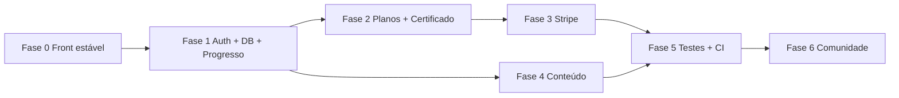

# Plano de implementação — EstudaCode

> Roadmap por fases, do estado atual (MVP visual) até plataforma em produção.  
> Estimativas assumem 1 dev em tempo parcial; ajuste conforme equipe.

---

## Situação atual (baseline)

| Item | Status |
|------|--------|
| Frontend navegável (26+ rotas) | ✅ |
| Service layer + hooks preparados | ✅ |
| Dados mock (`data/`) | ✅ |
| `npm run build` + `tsc --noEmit` | ✅ (após correções de maio/2026) |
| Auth / API / banco real | ❌ |
| Progresso persistido no servidor | ❌ |
| Conteúdo completo (70 módulos prometidos) | ❌ (19 cadastrados) |
| Stripe / planos reais | ❌ |
| Testes + CI | ❌ |

---

## Fase 0 — Estabilização do front (1 semana)

**Objetivo:** deployável na Vercel sem erros; bugs de UX óbvios resolvidos.

### Entregas

- [x] Build e typecheck verdes (`npm run build`, `tsc --noEmit`)
- [x] `EmptyState` com `icon` opcional (default `Inbox`)
- [x] `/busca` com `Suspense` + `useSearchParams` (co-location em `_components/BuscaContent`)
- [x] `projetos/page.tsx` — contagem via `todosProjetos` (não `projetos` indefinido)
- [x] `certificado` — narrowing após `notFound()`
- [x] `data/conteudo.ts` — tipo `ConteudoTopico` separado do objeto `conteudoPorTopico` (+ conteúdo demo/fw)
- [x] `/cadastro` — `Suspense` com fallback (parâmetro `?plano=`)
- [ ] `Sidebar` — logout limpa cookie `estudacode-token`
- [ ] `notificacoes` — usar `DashboardLayout`
- [ ] `app/(platform)/layout.tsx` — layout compartilhado (evitar import repetido)
- [ ] Integrar `useAuth` em trilhas, planos e `TrilhaCard` (cadeado + CTA upgrade)
- [ ] Certificado: bloquear se trilha não 100% (regra local até Fase 2)
- [ ] GitHub Actions: `lint` + `tsc` + `build` em PR

### Critério de conclusão

Deploy preview na Vercel passa; fluxo login → trilha → conteúdo → logout funciona sem loop.

---

## Fase 1 — Backend core (2–3 semanas)

**Objetivo:** usuário real, sessão segura e progresso no banco.

### Stack sugerida

- **Supabase** — PostgreSQL + Auth + Storage (avatar)
- **Next.js Route Handlers** — `app/api/*`
- Opcional: **NextAuth.js** se preferir abstração sobre Supabase Auth

### Modelo mínimo (tabelas)

```
users          → id, email, nome, avatar_url, plano, created_at
trilhas        → (seed a partir de data/trilhas.ts)
modulos        → (seed a partir de data/modulos.ts)
topicos        → ...
progresso      → user_id, topico_id, concluido, updated_at
assinaturas    → user_id, stripe_customer_id, plano, status, expires_at
certificados   → user_id, trilha_slug, codigo, concluido_em
```

### Entregas

- [ ] `.env.example` com variáveis Supabase
- [ ] Migrar login/cadastro/logout para Supabase Auth
- [ ] Substituir cookie mock no `middleware.ts` por sessão JWT/Supabase
- [ ] `lib/contexts/AuthContext.tsx` — nome, email, plano, avatar
- [ ] API `GET/PATCH /api/progresso` — substituir localStorage em `useProgresso`
- [ ] Services passam a chamar API (manter mesmas assinaturas públicas)
- [ ] Dashboard e trilhas leem progresso real
- [ ] Seed script: trilhas + módulos + tópicos do `data/`

### Critério de conclusão

Novo usuário cadastra, estuda um tópico, recarrega a página e o progresso permanece.

---

## Fase 2 — Regras de negócio e acesso (1–2 semanas)

**Objetivo:** planos, certificados e rotas coerentes com o que o usuário pagou/concluiu.

### Entregas

- [ ] Middleware ou helper `temAcesso(plano, recurso)` no servidor (não só client)
- [ ] Trilha demo gratuita; demais exigem Pro/Vitalício
- [ ] Certificado só se `progresso trilha === 100%`
- [ ] PDF ou imagem do certificado (server-side ou `@react-pdf/renderer`)
- [ ] Histórico de atividades no dashboard (últimos tópicos/exercícios)
- [ ] Configurações: salvar perfil, senha, preferências de notificação
- [ ] Rate limiting básico nas APIs (Upstash ou middleware)

### Critério de conclusão

Usuário free não acessa trilha Pro; usuário que concluiu trilha vê certificado válido com ID estável.

---

## Fase 3 — Monetização Stripe (2 semanas)

**Objetivo:** checkout, webhook e portal do cliente.

### Fluxo

```
/planos → escolhe plano → /api/stripe/checkout
       → Stripe Checkout → webhook atualiza assinatura
       → plano no perfil + middleware libera conteúdo
```

### Entregas

- [ ] Contas Stripe test + prod
- [ ] `POST /api/stripe/checkout` — session por plano (mensal/anual/vitalício)
- [ ] `POST /api/stripe/webhook` — `checkout.session.completed`, `subscription.*`
- [ ] `GET /api/stripe/portal` — gerenciar assinatura
- [ ] Cadastro lê `?plano=pro|vitalicio` e associa intenção
- [ ] Cupons: validar no servidor (não só objeto local em `planos/page.tsx`)

### Critério de conclusão

Pagamento teste em sandbox libera trilhas Pro; cancelamento reverte acesso após período.

---

## Fase 4 — Conteúdo e CMS (contínuo, 4–8 semanas)

**Objetivo:** fechar gap 19/72 módulos e 5/42 tópicos com conteúdo real.

### Prioridade de trilhas

1. **trilha-demo** — 2 módulos (freemium)
2. **fundamentos-web** — 8 módulos
3. **react-moderno** — 12 módulos
4. Demais conforme demanda

### Entregas

- [ ] Mover exercícios/quizzes de inline para `data/` + serviços
- [ ] CMS headless (Notion API, Sanity ou tabelas `conteudo` no Supabase)
- [ ] `getConteudo()` lê do banco; remover fallback genérico progressivamente
- [ ] TOC dinâmico a partir do markdown/estrutura do artigo
- [ ] Editor de código nos exercícios (Monaco ou CodeMirror)
- [ ] Blog: posts restantes com conteúdo real

### Critério de conclusão

Trilha demo + fundamentos 100% navegáveis com conteúdo específico (sem placeholder).

---

## Fase 5 — Qualidade e operação (1–2 semanas)

**Objetivo:** confiança para escalar tráfego e equipe.

### Entregas

- [ ] Testes E2E críticos (Playwright): cadastro, login, marcar tópico, checkout
- [ ] Testes unitários em services e `temAcesso`
- [ ] Sentry ou similar para erros em produção
- [ ] Analytics (Plausible/Posthog): conversão plano, conclusão módulo
- [ ] Documentação de runbook (deploy, rollback, webhook Stripe)
- [ ] LGPD: exportação/exclusão de conta funcionando (já previsto na UI)

### Critério de conclusão

CI bloqueia merge se build ou E2E smoke falhar; alertas em erro 5xx.

---

## Fase 6 — Comunidade e crescimento (opcional)

- Comentários por módulo
- Perfis públicos reais
- Fórum ou integração Discord
- Notificações por e-mail (Resend)
- Programa de indicação / afiliados

---

## Ordem recomendada (resumo)



| Fase | Duração estimada | Dependências |
|------|------------------|--------------|
| 0 | ~1 semana | — |
| 1 | 2–3 semanas | Fase 0 |
| 2 | 1–2 semanas | Fase 1 |
| 3 | ~2 semanas | Fase 1–2 |
| 4 | 4–8 semanas | Fase 1 (paralelo com 2–3) |
| 5 | 1–2 semanas | Fases 1–3 |
| 6 | contínuo | Fase 5 |

---

## Riscos e decisões

| Tema | Decisão sugerida |
|------|------------------|
| Auth | Supabase Auth nativo (menos peças que NextAuth + Supabase) |
| Pagamentos | Stripe (já documentado no projeto) |
| Conteúdo | Supabase + markdown antes de CMS externo |
| Deploy | Vercel + Supabase cloud |
| Não fazer cedo | Microserviços, app mobile, IA no editor |

---

## Referências no repositório

- Bugs front pendentes: `TODO.md`
- Arquitetura alvo: `PROJECT_OVERVIEW.md`, `FUTURE_PLANNING.md`
- Features implementadas: `FEATURES.md`

**Última atualização:** maio 2026
